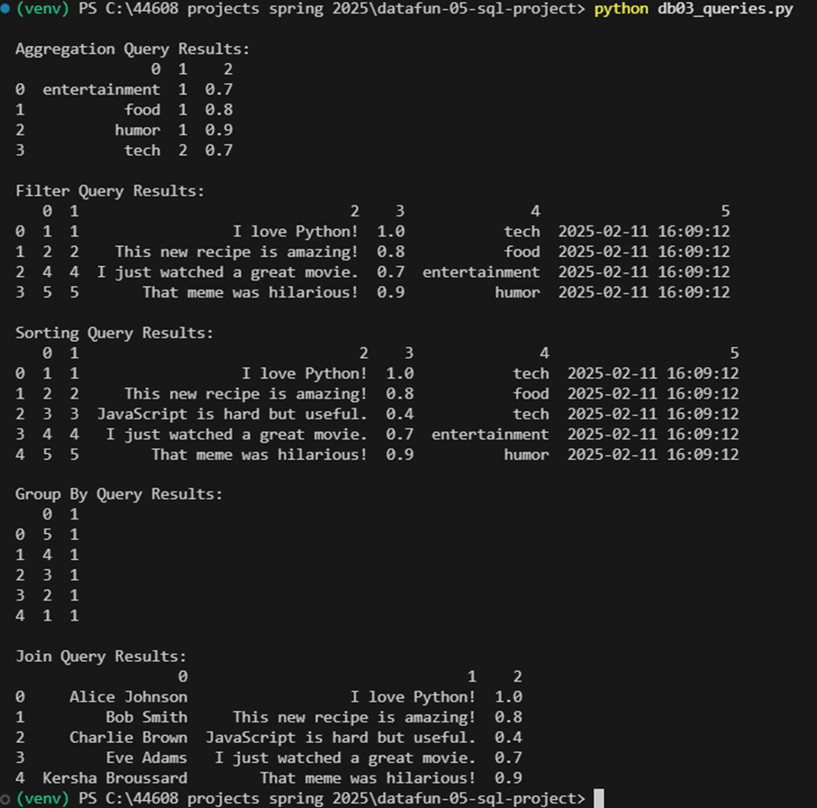
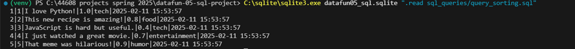
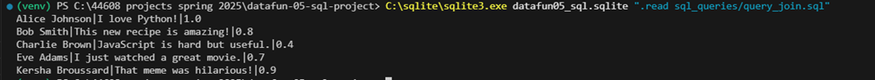
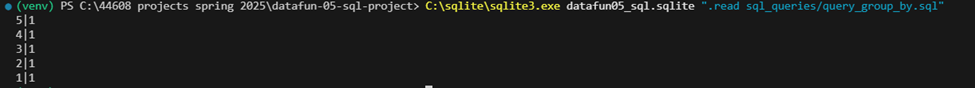
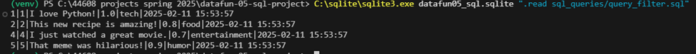
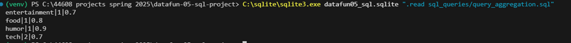

# Kersha's DataFun-05-SQL-Project

## DataFun-05-SQL-Project

### Overview
This project creates a relational SQLite database for users and messages from buzzline_data.json, demonstrating how to:
- Create a database schema
- Load data from CSV files
- Query and manipulate data with SQL

**DataFun-05-SQL** is a structured SQL-based project designed to demonstrate database creation, schema management, data manipulation, and querying using SQLite and Python. This project involves designing a schema with at least two related tables, inserting records, performing SQL operations, and generating insights using queries. The implementation is carried out through a combination of SQL scripts and Python automation.


 ## Summary of Execution Order
1. Drop existing tables:   01_drop_tables.sql
2. Create schema:   02_create_tables.sql
3. Insert data:  03_insert_records.sql
4. Run database setup script:  db01_setup.py
5. Clean & modify data:   update_records.sql, delete_records.sql
6. Run feature script:   db02_features.py
7. Perform queries:   query_aggregation.sql, query_filter.sql, etc.
8. Run final query script:   db03_queries.py
### Then verify that the setup is correct by executing SELECT * FROM user; or * FROM messages;SELECT * FROM authors;
SELECT * FROM books;, or whatever your table name is, and observe the output.

## How to Run the Project

### **Step 1: Setup Environment**
1. Ensure **Python** and **SQLite** are installed on your system.
2. Create and activate a virtual environment:
   ```bash
   python -m venv venv
   venv\Scripts\Activate  # On Windows
   source venv/bin/activate  # On macOS/Linux
   ```
3. Install dependencies:
   ```bash
   pip install -r requirements.txt
   ```

### **Step 2: Setup the Database**
1. Open a terminal and navigate to the project folder:
   ```bash
   cd path/to/datafun-05-sql-projects
   ```
2. Run the following command to initialize the database:
   ```bash
   C:\sqlite\sqlite3.exe buzzline_db.sqlite ".read sql_create/02_create_tables.sql"
   ```
3. Insert records into the database:
   ```bash
   C:\sqlite\sqlite3.exe buzzline_db.sqlite ".read sql_create/03_insert_records.sql"
   ```

### **Step 3: Run Python Scripts**
- **To create and populate the database:**
  ```bash
  python db01_setup.py
  ```
  
- **To update or delete records:**
  ```bash
  python db02_features.py
  ```
  
- **To run queries and analyze data:**
  ```bash
  python db03_queries.py
  ```
  

  ## Query Results

Below are screenshots of the query results:

![Query Results]






### Expected Outputs
#### Table Schema
##### The database consists of two related tables:
1.	users (stores user details such as name and email)
2.	messages (stores messages, sentiment scores, and category)


## Contributors
- **Kersha Broussard**

## License
This project is licensed under the MIT License.


